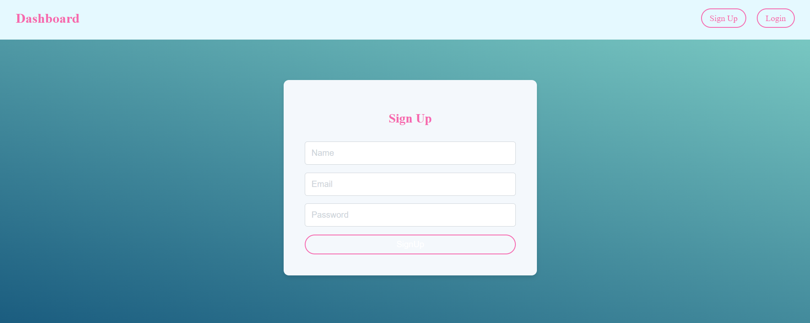

# webledger# transaction_app
# Blog-Application

This project is a full-featured recipe search application built using the MERN stack. It demonstrates advanced features such as user authentication,  CRUD operations, add transaction, view the all recipe.
## Backend : https://transaction-app-4.onrender.com
## frontend : https://webledger-seven.vercel.app/

## Features

### 1. User Authentication and Authorization
JWT Authentication: Secure login and registration using JSON Web Tokens.
User Roles:

## Technology Stack
Frontend: React.js
Backend: Node.js, Express.js
Database: MongoDB
Authentication: JWT (JSON Web Tokens)

## Run the Backend Server
#### npm run server
#### npm start

##  Run the Frontend Server
#### npm run dev

<!-- ## Screenshot
 -->